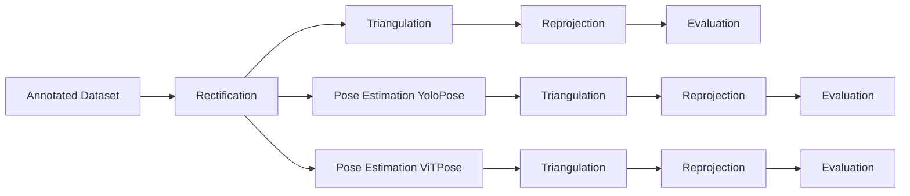

# Multi-Camera 3D Human Pose Estimation

A comprehensive computer vision pipeline for multi-camera 3D human pose estimation that processes 2D keypoint annotations through image rectification, 3D triangulation, reprojection, and evaluation phases using state-of-the-art pose estimation models (YOLO and ViTPose).

Developed as a project for Professor Conci's Computer Vision course at the University of Trento.

## 🎯 Overview

This project implements an end-to-end pipeline that transforms multi-view 2D human poses into accurate 3D reconstructions. The system handles both dataset processing (with ground truth annotations) and real-time video processing modes, supporting multiple pose estimation models and providing comprehensive evaluation metrics.

## 🏗️ Architecture

**Annotated Dataset Pipeline**


*Note: The processing is not parallel, but it is represented like this for diagram clarity purposes. The three branches can be activated or deactivated.*

**Videos Pipeline**


## 🚀 Quick Start

### Installation

1. **Clone the repository**
   ```bash
   git clone https://github.com/MarcoMorandin/computer-vision.git
   cd computer-vision
   ```

2. **Install UV (recommended package manager)**
    [UV](https://github.com/astral-sh/uv) is a fast Python package manager and project manager written in Rust:
    - **Speed**: 10-100x faster than pip for package installation and resolution
    - **Reliability**: Deterministic dependency resolution with lock files
    - **Simplicity**: Single tool for project management, dependency handling, and virtual environments
    - **Compatibility**: Drop-in replacement for pip with full ecosystem support

   ```bash
   # Install uv via pip
   pip install uv
   
   # Alternative installation methods:
   # curl -LsSf https://astral.sh/uv/install.sh | sh  # Unix/macOS
   # powershell -c "irm https://astral.sh/uv/install.ps1 | iex"  # Windows
   ```


3. **Set up environment**
   ```bash
   # Using uv (recommended)
   uv sync
   
   # Or using pip
   pip install -e .
   ```

4. **Download model weights**
   ```bash
   mkdir -p weights #Folder where to store models wheights
   ```

### Dataset Processing
```bash
# Using uv (recommended)
uv run main.py --config-name=config_dataset

# Using python directly
python main.py --config-name=config_dataset
```

### Video Processing  
```bash
# Using uv (recommended)
uv run main.py --config-name=config_video

# Using python directly
python main.py --config-name=config_video
```

## ⚙️ Configuration

The project uses [Hydra](https://hydra.cc/) for configuration management, providing flexible and composable settings.

### Why Hydra?
- **Composable Configurations**: Modular YAML files that can be mixed and matched
- **Multi-run Support**: Automated hyperparameter sweeps and experiments

Hydra eliminates the need for complex argument parsing and enables elegant experiment management, making it ideal for research and production pipelines.

### Configuration Structure

```yaml
# Main configuration (config_dataset.yaml or config_video.yaml)
defaults:
  - logging: default
  - models: default
  - paths: dataset
  - pipeline: dataset

mode: "dataset"  # or "video"
```

### Key Configuration Files

- **`models/default.yaml`**: Model-specific settings
- **`paths/dataset.yaml`**: Input/output directory structures
- **`pipeline/dataset.yaml`**: Pipeline stage enable/disable flags
- **`logging/default.yaml`**: Logging configuration


## 📊 Complete Output Structure

The pipeline generates a comprehensive directory structure organized by processing mode and model type:

```
output/
├── dataset/                              # Dataset processing outputs
│   ├── rectified/                           # Rectified images and annotations
│   │   └── visualizations/                     # Rectified pose visualizations
│   ├── ground_truth/                        # Ground truth results
│   │   ├── triangulated/                       # 3D poses
│   │   │   └── visualizations/                     # 3D animation file
│   │   ├── reprojected/                        # Reprojected ground truth poses
│   │   │   └── visualizations/                     # 2D reprojection overlays
│   │   └── evaluations/                        # Ground truth evaluation
│   │       └── reprojections/                      # Reprojection metrics
│   ├── yolo/                                # YOLO model results
│   │   ├── predictions/                        # 2D pose predictions
│   │   │   └── visualizations/                     # YOLO pose overlays
│   │   ├── triangulations/                     # 3D triangulated poses
│   │   │   └── visualizations/                     # 3D YOLO animation
│   │   ├── reprojections/                      # Reprojected YOLO poses
│   │   │   └── visualizations/                     # 2D reprojection overlays
│   │   └── evaluations/                        # YOLO evaluation metrics
│   │       ├── predictions/                        # 2D prediction accuracy
│   │       └── reprojections/                      # 3D reprojection accuracy
│   └── vit/                                 # ViTPose model results
│       ├── predictions/                        # 2D pose predictions
│       │   └── visualizations/                     # ViTPose pose overlays
│       ├── triangulations/                     # 3D triangulated poses
│       │   └── visualizations/                     # 3D ViTPose animation
│       ├── reprojections/                      # Reprojected ViTPose poses
│       │   └── visualizations/                     # 2D reprojection overlays
│       └── evaluations/                        # ViTPose evaluation metrics
│           ├── predictions/                        # 2D prediction accuracy
│           └── reprojections/                      # 3D reprojection accuracy
└── video/                                # Video processing outputs
    ├── rectified/                           # Rectified video files
    ├── yolo/                                # YOLO video results
    │   ├── predictions/                        # Annotated video files + COCO
    │   └── triangulations/                     # 3D pose sequences
    └── vit/                                 # ViTPose video results
        ├── predictions/                        # Annotated video files + COCO
        └── triangulations/                     # 3D pose sequences
```
